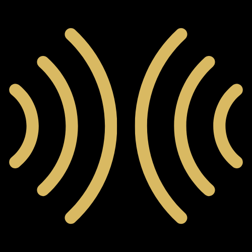

<p align="center">
  
</p>

<h1 align="center">Blackrock GO</h1>
<p align="center">
  Map-first, black-and-gold mesh communications for Black Rock City.<br/>
  Pair with <b>any Meshtastic device</b>, chat in encrypted camp channels, and overlay scheduled events.
</p>

---

## ✨ What is Blackrock GO?

Blackrock GO is a lightweight, Burning Mesh–compatible client focused on **reliable communications** and **clear field UX**:

- 🗺️ **Map-first UI** — City map at launch with friend nodes, channels, and time-gated event markers  
- 📡 **Meshtastic via BLE** — Pair with any Meshtastic-flashed radio (Heltec, LilyGO/TTGO, etc.)  
- 🔒 **Camp channels & DMs** — Up to 8 encrypted channels; DMs for 1:1 chat  
- 📍 **Location sharing etiquette** — “Everyone” (public) stays location-OFF by default  
- 🗓️ **Scheduled Events Overlay** — Load a JSON schedule; markers appear only during active windows  
- ⚙️ **Offline-first** — Works without cell/Wi-Fi once paired with your radio

> **Note:** We are not affiliated with Burning Man Project or Burningmesh Project. We respect the their IP and message etiquette and aim to be good mesh citizens.


## Getting Started

### Prerequisites
- Flutter SDK (latest version)
- Firebase account and project setup
- Environment configuration

### Installation
1. Clone the repository
```bash
git clone https://github.com/yourusername/blackrock_go.git
```

2. Install dependencies
```bash
flutter pub get
```

3. Create a `.env` file in the root directory with your environment variables

4. Run the application
```bash
flutter run
```

## Building for Different Platforms

Alpha Go is a cross-platform application built with Flutter that supports:
- Android
- iOS


## Acknowledgements

- Flutter and Dart teams
- Firebase platform
- All third-party libraries used in this project
