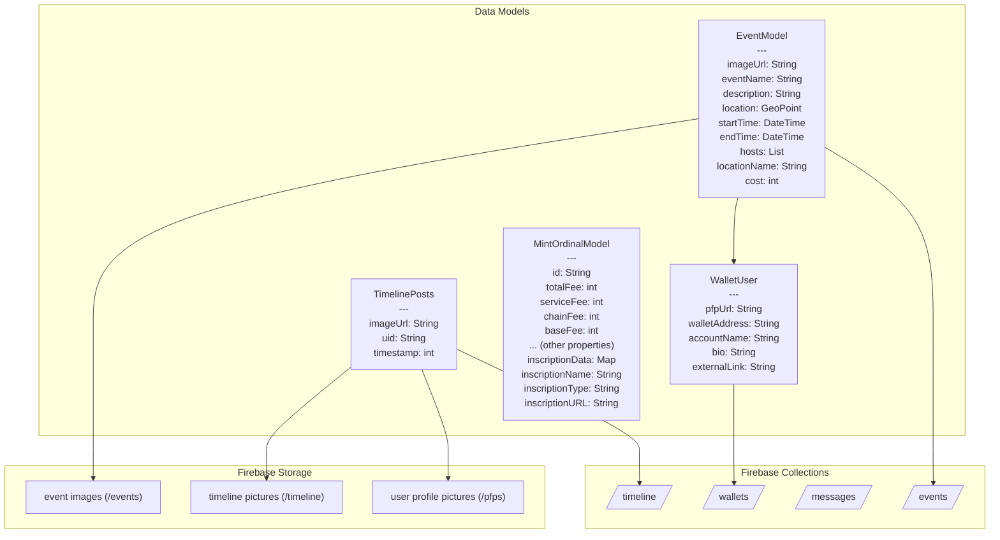

# Burning Man Companion App

This project is a companion app for the Burning Man festival, designed to help attendees connect, discover events, share experiences, and navigate the playa. Built with Flutter, it offers a seamless and interactive experience for festival-goers.


## Overview

The Burning Man Companion App brings together social networking, event discovery, and personal journaling for the unique environment of Black Rock City. Users can create and join events, share moments, connect with others, and personalize their festival journey.

## Key Features

- **Event Discovery & Management**: Find, create, and join events happening across the playa, with location-based features.
- **Social Timeline**: Share photos and moments, and view posts from other attendees in a timeline format.
- **User Profiles**: Personalize your profile with a picture and display name.
- **Biometric Authentication**: Secure your app with biometric authentication.
- **Responsive Design**: Optimized for all device sizes.
- **Map Integration**: Navigate the playa and find event locations easily.

## Technical Architecture

### Tech Stack
- **Frontend**: Flutter
- **Backend**: Firebase (Authentication, Firestore, Storage)
- **State Management**: GetX
- **Routing**: Go Router
- **Secure Storage**: Shared Preferences
- **Maps & Location**: MapBox integration

## Database Schema

Below is a flowchart representation of the Burning Man Companion App database schema showing models and their relationships with Firebase collections:



### Collection Details

1. **wallets** - Stores user profile information
   - Each document represents a user with wallet address as ID
   - Contains profile data (name, bio, profile picture URL, wallet details)

2. **events** - Stores event information
   - Each document represents a single event with event details
   - References to hosts (as wallet addresses)
   - Contains event metadata (name, description, location, time)

3. **messages** - Stores communication between users
   - Direct messaging functionality

4. **timeline** - Stores user timeline posts
   - Each document represents a post with image URL and timestamp
   - References the user who created the post

### Storage Structure

Firebase Storage is used to store various media files:
- **/pfps** - User profile pictures
- **/events** - Event images
- **/timeline** - Timeline post images

## Application Flow

1. **Onboarding & Authentication**:
   - User creates or imports a wallet using mnemonic phrases
   - Sets up password protection
   - Authentication with biometrics

2. **Main Features**:
   - Home screen with timeline posts and events
   - Wallet management for cryptocurrency assets
   - Event creation and discovery
   - Social interaction with other users

## Getting Started

### Prerequisites
- Flutter SDK (latest version)
- Firebase account and project setup
- Environment configuration

### Installation
1. Clone the repository
```bash
git clone https://github.com/yourusername/blackrock_go.git
```

2. Install dependencies
```bash
flutter pub get
```

3. Create a `.env` file in the root directory with your environment variables

4. Run the application
```bash
flutter run
```

## Building for Different Platforms

Alpha Go is a cross-platform application built with Flutter that supports:
- Android
- iOS


## Acknowledgements

- Flutter and Dart teams
- Firebase platform
- All third-party libraries used in this project
